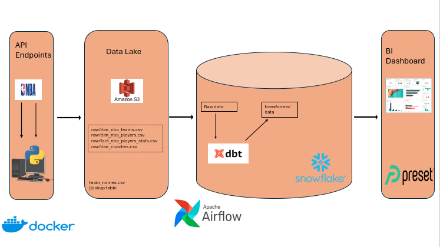
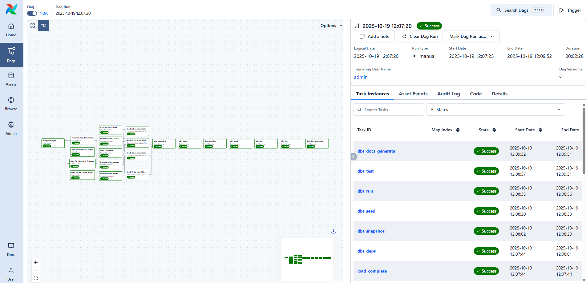
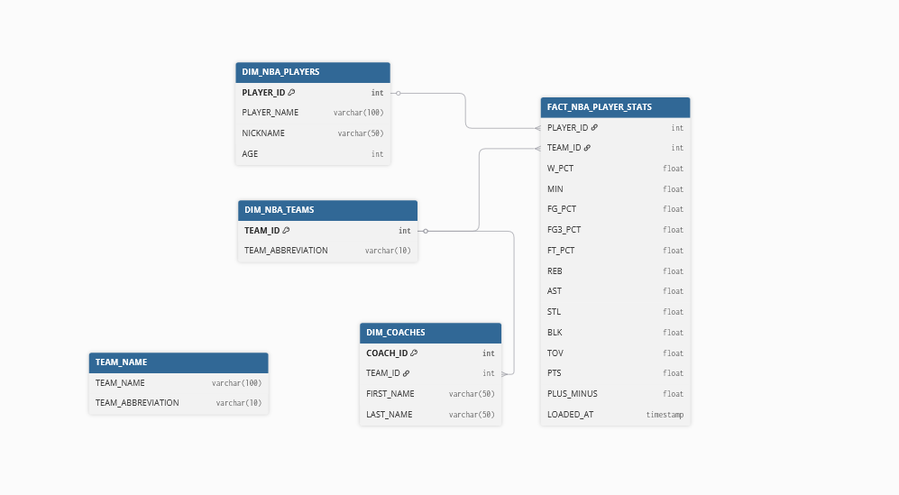
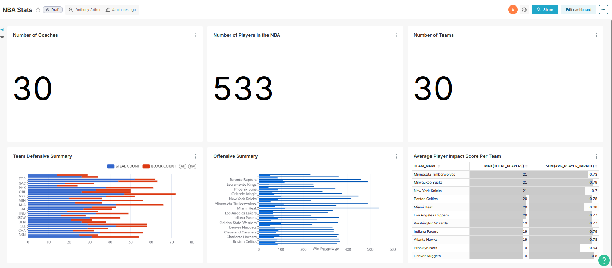

#  NBA Data Engineering Pipeline

An **end-to-end data engineering and analytics engineering project** that extracts, stages, transforms, and orchestrates **NBA player and team performance data** using **AWS S3**, **Snowflake**, **dbt**, and **Apache Airflow**, fully containerized via **Docker**.  
Final insights are visualized through an **Apache Preset** dashboard.

---

##  Architecture Overview

**Pipeline Flow:**
1. **Extract & Stage** → Raw NBA player/team data extracted via API and staged in **S3**
2. **Load** → Airflow tasks load data from S3 → **Snowflake** raw tables
3. **Transform** → **dbt** models build the `staging → intermediate → mart` layers  
4. **Orchestrate** → Airflow DAG automates all steps (`load → dbt deps → seed → run → test → docs`)
5. **Visualize** → Final analytical dashboards built in **Preset / Superset**

---

##  System Architecture


---

##  Airflow DAG Execution

Below is a successful DAG run showing the orchestrated data pipeline:



Each green box represents a completed Airflow task within the end-to-end workflow.

---

##  dbt Workflow

The dbt workflow automates transformations across **bronze → silver → gold** layers:


---

##  ERD Diagram



---

---

---

##  Run Sequence

```bash
dbt deps      # install dependencies
dbt seed      # load lookup/seed tables
dbt run       # build models (stg → int → mart)
dbt test      # validate data quality
dbt docs generate && dbt docs serve  # build documentation
```

---

##  Setup & Deployment

### 1️ Create Snowflake DWH Objects

```sql
-- use account admin role
USE ROLE ACCOUNTADMIN;

-- create db, schema, and wh engine
CREATE DATABASE IF NOT EXISTS NBA_DB;
CREATE SCHEMA IF NOT EXISTS NBA_SCHEMA;
CREATE WAREHOUSE IF NOT EXISTS NBA_WH
    WAREHOUSE_SIZE = 'X-SMALL'
    AUTO_SUSPEND = 30;
    
-- create a dedicated role for dbt
CREATE ROLE IF NOT EXISTS DBT_ROLE;
    
-- create user
CREATE USER IF NOT EXISTS DBT_USER
  PASSWORD = ''
  LOGIN_NAME = 'dbt'
  MUST_CHANGE_PASSWORD = FALSE
  DEFAULT_WAREHOUSE = 'NBA_WH'
  DEFAULT_ROLE = 'DBT_ROLE'
  DEFAULT_NAMESPACE = 'NBA_DB.NBA_SCHEMA'
  COMMENT = 'FOR DATA MODELING AND TRANSFORMATIONS';

-- grant role to user
GRANT ROLE DBT_ROLE TO USER DBT_USER;
GRANT ROLE DBT_ROLE TO ROLE ACCOUNTADMIN;

-- grant privelages to role
USE DATABASE NBA_DB;
USE SCHEMA NBA_SCHEMA;
GRANT USAGE ON DATABASE NBA_DB TO ROLE DBT_ROLE;
GRANT USAGE ON SCHEMA NBA_SCHEMA TO ROLE DBT_ROLE;
GRANT USAGE ON WAREHOUSE NBA_WH TO ROLE DBT_ROLE;


-- set up permissions to role dbt_role
GRANT ALL ON WAREHOUSE NBA_WH TO ROLE DBT_ROLE; 
GRANT ALL ON DATABASE NBA_DB TO ROLE DBT_ROLE;
GRANT ALL ON ALL SCHEMAS IN DATABASE NBA_DB to ROLE DBT_ROLE;
GRANT ALL ON FUTURE SCHEMAS IN DATABASE NBA_DB to ROLE DBT_ROLE;
GRANT ALL ON ALL TABLES IN SCHEMA NBA_SCHEMA to ROLE DBT_ROLE;
GRANT ALL ON FUTURE TABLES IN SCHEMA NBA_SCHEMA to ROLE DBT_ROLE;
GRANT TRUNCATE ON ALL TABLES IN SCHEMA NBA_DB.NBA_SCHEMA TO ROLE DBT_ROLE;
GRANT TRUNCATE ON FUTURE TABLES IN SCHEMA NBA_DB.NBA_SCHEMA TO ROLE DBT_ROLE;

-- create tables
USE DATABASE NBA_DB;
USE SCHEMA NBA_SCHEMA;
CREATE OR REPLACE TABLE DIM_NBA_TEAMS (
    TEAM_ID            NUMBER(38,0),
    TEAM_ABBREVIATION  VARCHAR(16777216)
);
CREATE OR REPLACE TABLE DIM_NBA_PLAYERS (
    PLAYER_ID    NUMBER(38,0),
    PLAYER_NAME  VARCHAR(16777216),
    NICKNAME     VARCHAR(16777216),
    AGE          NUMBER(38,0)
);
CREATE OR REPLACE TABLE DIM_COACHES (
    TEAM_ID     NUMBER(38,0),
    COACH_ID    NUMBER(38,0),
    FIRST_NAME  VARCHAR(50),
    LAST_NAME   VARCHAR(50)
);
CREATE OR REPLACE TABLE FACT_NBA_PLAYER_STATS (
    PLAYER_ID   NUMBER(38,0),
    TEAM_ID     NUMBER(38,0),
    W_PCT       FLOAT,
    MIN         FLOAT,
    FG_PCT      FLOAT,
    FG3_PCT     FLOAT,
    FT_PCT      FLOAT,
    REB         FLOAT,
    AST         FLOAT,
    STL         FLOAT,
    BLK         FLOAT,
    TOV         FLOAT,
    PTS         FLOAT,
    PLUS_MINUS  FLOAT,
    LOADED_AT   TIMESTAMP_LTZ(9)
);
```

---

###  dbt Profile (profiles.yml)

```yaml
nba_dbt:
  target: dev
  outputs:
    dev:
      type: snowflake
      account: <your_account>
      user: <your_user>
      password: <your_password>
      role: DBT_ROLE
      warehouse: NBA_WH
      database: NBA_DB
      schema: DEV
```
>  Note: profiles.yml should be **.gitignored** for security.

---

###  Docker Setup

**Clone the Repository**
```bash
git clone https://github.com/<your-username>/nba-data-pipeline.git
cd nba-data-pipeline
```

**Build the Docker image**
```bash
docker build --pull --rm -f "Dockerfile" -t "nba_airflow:latest" .
```

**Launch Airflow & dbt Containers**
```bash
docker compose -f "docker-compose.yml" up -d --build airflow
docker compose -f "docker-compose.yml" up -d --build dbt
```

> Once running, connect Snowflake in Airflow UI and create a variable for authorization.

---

##  BI Layer (Apache Preset)

Run this in Snowflake to configure Preset access:

```sql
-- SuperSet Privelages
-- Use an admin role
USE ROLE ACCOUNTADMIN;
CREATE ROLE IF NOT EXISTS REPORTER;
CREATE USER IF NOT EXISTS PRESET
PASSWORD=''
LOGIN_NAME='PRESET'
MUST_CHANGE_PASSWORD=FALSE
DEFAULT_WAREHOUSE='NBA_WH'
DEFAULT_ROLE='REPORTER'
DEFAULT_NAMESPACE='NBA.DEV'
COMMENT='Preset user for creating reports';
GRANT ROLE REPORTER TO USER PRESET;
GRANT ROLE REPORTER TO ROLE ACCOUNTADMIN;
GRANT ALL ON WAREHOUSE NBA_WH TO ROLE REPORTER;
GRANT USAGE ON DATABASE NBA_DB TO ROLE REPORTER;
GRANT USAGE ON SCHEMA NBA_SCHEMA TO ROLE REPORTER;
GRANT SELECT ON ALL TABLES IN SCHEMA NBA_SCHEMA TO ROLE REPORTER;
GRANT SELECT ON ALL VIEWS IN SCHEMA NBA_SCHEMA TO ROLE REPORTER;
GRANT SELECT ON FUTURE TABLES IN SCHEMA NBA_SCHEMA TO ROLE REPORTER;
GRANT SELECT ON FUTURE VIEWS IN SCHEMA NBA_SCHEMA TO ROLE REPORTER;

CREATE OR REPLACE NETWORK POLICY PRESET_POLICY
  ALLOWED_IP_LIST = (
    '35.161.45.11',
    '54.244.23.85',
    '52.32.136.54'
  )
  BLOCKED_IP_LIST = ();

ALTER USER PRESET SET NETWORK_POLICY = PRESET_POLICY;

```

---

##  Preset Dashboard

Here’s the NBA analytics dashboard visualizing player and team KPIs:



---

## Summary

This project demonstrates:
- **Modern ELT orchestration** with Airflow and dbt  
- **Scalable data modeling** (Bronze–Silver–Gold) in Snowflake  
- **Containerized development** via Docker Compose  
- **Analytical insights** delivered through Apache Preset dashboards  
